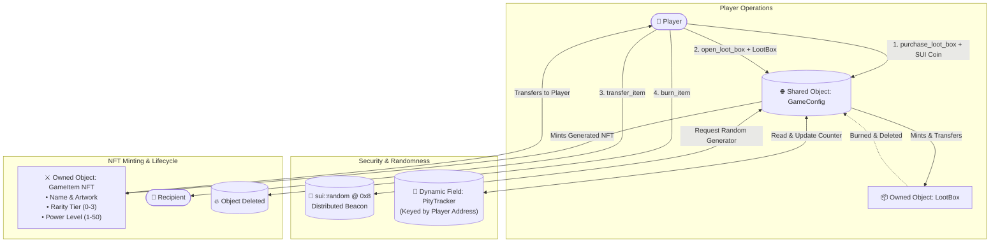

# 🎁 Sui Move Gaming Loot Box & NFT Ecosystem

[](https://docs.sui.io/)
[](https://docs.sui.io/guides/developer/advanced/randomness-onchain)
[](https://docs.sui.io/concepts/object-model)
[](contracts/tests/lootbox_tests.move)
[](frontend/)
[](LICENSE)

A decentralized Web3 Gaming Loot Box and NFT ecosystem developed in **Sui Move (2024 Edition)**. Utilizes Sui's native on-chain randomness (`sui::random`), tamper-proof non-composable `entry` function protection, and an on-chain **Dynamic Fields Pity System** to deliver verifiably fair, transparent digital asset unboxing.

---

## 🌟 Key Highlights & Engineering Features

- 🎲 **Verifiable Native On-Chain Randomness:** Direct integration with Sui's distributed threshold validator beacon (`sui::random` at `0x8`) eliminating centralized oracles and latency.
- 🛡️ **Anti-Exploit Security Architecture:** Uses private `entry fun open_loot_box` to prevent test-and-abort rollback attacks and MEV arbitrage.
- 🧩 **Dynamic Field Pity Engine (Bonus Challenge):** Verifiable bad-luck mitigation tracking consecutive non-legendary opens per user; guarantees a Legendary NFT after 30 misses.
- ⚔️ **Dynamic NFT Display Standard:** Integrates `sui::display` to dynamically render equipment names, power scores (1–50), and metadata directly in Sui explorers and wallets.
- 💎 **Full Asset Lifecycle:** Unopened `LootBox` objects, NFT minting, peer-to-peer `transfer_item`, and irreversible `burn_item`.
- 👑 **Admin Governance & Treasury Control:** Controlled via `AdminCap` with real-time drop weight adjustment, price configuration, emergency circuit breaker (`set_paused`), and treasury fee withdrawal.
- 🎮 **Production-Grade Web3 dApp:** Built with React, TypeScript, Tailwind CSS, Lucide Icons, and Web Audio API procedural sound synthesis for 3D unboxing suspense and card reveals.

---

## 📐 Architecture & Object Flow



---

## 📊 Rarity Distribution & Power Matrix

The game uses cumulative probability thresholds generated across random byte ranges $0 \le \text{roll} \le 99$:

| Tier | Weight | Nominal Drop Rate | Power Range | Roll Threshold Range |
| :--- | :---: | :---: | :---: | :---: |
| 🛡️ **Common** | 60 | 60.0% | 1 – 10 pts | `0 <= roll < 60` |
| 🔷 **Rare** | 25 | 25.0% | 11 – 25 pts | `60 <= roll < 85` |
| 🔮 **Epic** | 12 | 12.0% | 26 – 40 pts | `85 <= roll < 97` |
| 👑 **Legendary** | 3 | 3.0% | 41 – 50 pts | `97 <= roll <= 99` |

> **Dynamic Pity Guarantee:** When a user's consecutive non-legendary open counter reaches **30**, the system automatically bypasses standard roll probabilities and forces a **Legendary** drop (Power 41–50), immediately resetting the counter to 0.

---

## 🔒 Sui-Specific Randomness Security Rules

### 1. The Critical `entry` Function Rule
```move
// ✅ SECURE: Private entry function prevents composability exploits
entry fun open_loot_box(
    config: &mut GameConfig,
    lootbox: LootBox,
    r: &Random,
    ctx: &mut TxContext,
) { ... }
```
> **Why:** If `open_loot_box` were `public`, a malicious actor could write an exploit contract in a Programmable Transaction Block (PTB) that calls `open_loot_box`, inspects the resulting `GameItem.rarity`, and executes `abort` if the item is not Legendary. Sui enforces that non-public `entry` functions cannot be called from other Move modules.

### 2. In-Place RandomGenerator Instantiation
`RandomGenerator` is instantiated directly inside the consuming function scope via `random::new_generator(r, ctx)` and never accepted as a parameter.

---

## 📁 Repository Structure

```
gaminglootbox/
├── contracts/                  # Sui Move 2024 Smart Contracts
│   ├── Move.toml               # Package configuration with testnet dependencies
│   ├── sources/
│   │   └── lootbox.move        # Core module: GameConfig, LootBox, GameItem, AdminCap, Pity
│   └── tests/
│       └── lootbox_tests.move  # Comprehensive unit & scenario test suite
├── frontend/                   # Interactive Web3 Gaming dApp
│   ├── src/
│   │   ├── components/         # 3D Opener, Armory, Pity Gauge, Admin Portal, Event Logs
│   │   ├── hooks/              # Game state store & Web Audio sound synthesizer
│   │   ├── utils/              # Sui on-chain simulation & PTB transaction builders
│   │   └── types/              # TypeScript schemas & constants
│   ├── package.json
│   └── vite.config.ts
├── scripts/
│   ├── deploy.ts               # Automated Sui CLI publish script
│   └── simulate_ptb.ts         # TypeScript PTB invocation snippets
├── docs/
│   ├── ARCHITECTURE.md         # Full object model & gas optimization specs
│   ├── SECURITY_RANDOMNESS.md  # Deep dive into sui::random & MEV protection
│   └── PITY_SYSTEM.md          # Dynamic fields mathematical probability proofs
├── .github/workflows/ci.yml    # GitHub Actions automated test & build pipeline
└── README.md                   # Project documentation
```

---

## ⚡ Quickstart & Local Development

### Prerequisites
* [Node.js (v18+)](https://nodejs.org/)
* [Sui CLI (v1.30+)](https://docs.sui.io/guides/developer/getting-started/sui-install)

### 1. Smart Contracts & Move Tests

```bash
# Navigate to contracts directory
cd contracts

# Run unit & integration test scenarios
sui move test
```

### 2. Launch Interactive Frontend dApp

```bash
# Navigate to frontend directory
cd frontend

# Install dependencies
npm install

# Start local development server
npm run dev
```
Open **http://localhost:3000** in your browser to test mystery box opening, audio SFX, inventory transfer/burn, and admin control panel.

---

## 🧪 Test Suite Coverage Summary

| Test Scenario | Purpose | Status |
| :--- | :--- | :---: |
| `test_game_initialization` | Verifies `GameConfig` defaults, weights, price, and `AdminCap` distribution | ✅ Pass |
| `test_purchase_loot_box` | Validates SUI coin deduction, treasury deposit, overpayment refund, and serials | ✅ Pass |
| `test_open_all_rarity_tiers` | Validates deterministic rarity rolls (Common, Rare, Epic, Legendary) & power ranges | ✅ Pass |
| `test_pity_system_guarantee` | Simulates 30 consecutive non-legendary opens, verifies pity trigger & counter reset | ✅ Pass |
| `test_transfer_and_burn_item` | Tests peer-to-peer NFT transfer and permanent deletion | ✅ Pass |
| `test_admin_updates_and_treasury`| Verifies drop rate adjustment, price change, pause toggle, and fund withdrawal | ✅ Pass |
| `test_insufficient_payment_fails`| Asserts transaction abortion on underpayment | ✅ Pass |
| `test_invalid_weights_sum_fails` | Asserts transaction abortion when weight sum $\ne 100$ | ✅ Pass |
| `test_paused_game_fails` | Asserts transaction abortion when contract is paused | ✅ Pass |

---

## 📜 License

This project is licensed under the **MIT License**.
