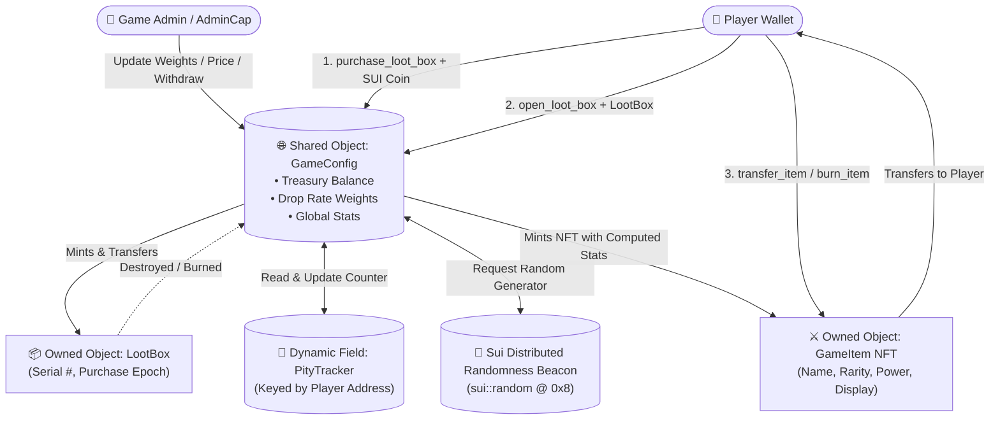

# 🏗️ Architecture & Object Model Deep-Dive

This document provides a comprehensive technical overview of the **Sui Move Gaming Loot Box & NFT System**, detailing object lifecycle management, shared state economics, on-chain randomness consumption, and dynamic field pity tracking.

---

## 1. System Architecture Overview



---

## 2. Object Model Specifications

### 2.1 `AdminCap` (Capability Object)
* **Abilities:** `key, store`
* **Lifecycle:** Minted once during `init` and transferred to the deployer.
* **Privileges:**
  - `update_rarity_weights`: Adjusts Common, Rare, Epic, and Legendary distribution weights.
  - `update_price`: Updates the price required per loot box purchase.
  - `withdraw_treasury`: Collects accumulated SUI coin balances from the shared `GameConfig`.
  - `set_paused`: Emergency circuit breaker to pause/unpause minting and opening.

### 2.2 `GameConfig` (Shared Object)
* **Abilities:** `key`
* **State Variables:**
  - `common_weight`, `rare_weight`, `epic_weight`, `legendary_weight` (Sum must strictly equal 100)
  - `box_price`: Price per box in MIST ($10^9 \text{ MIST} = 1 \text{ SUI}$)
  - `pity_threshold`: Number of consecutive non-legendary opens required to trigger guaranteed Legendary (Default: 30)
  - `treasury`: `Balance<SUI>` accumulating revenue
  - `total_boxes_purchased`, `total_boxes_opened`, `total_items_minted`: Global verifiable counters
  - `is_paused`: Boolean flag

### 2.3 `LootBox` (Owned Container Object)
* **Abilities:** `key, store`
* **Fields:** `id: UID`, `serial_number: u64`, `purchased_at_epoch: u64`, `purchased_by: address`
* **Lifecycle:** Exists as an owned asset in the player's wallet until passed into `open_loot_box`, where it is permanently consumed and destroyed via `object::delete(id)`.

### 2.4 `GameItem` (Owned NFT Asset)
* **Abilities:** `key, store`
* **Fields:**
  - `id: UID`
  - `name: String`
  - `description: String`
  - `image_url: String`
  - `rarity: u8` (0: Common, 1: Rare, 2: Epic, 3: Legendary)
  - `power: u64` (Calculated within tier power range)
  - `serial_number: u64`
  - `minted_at_epoch: u64`
  - `original_owner: address`
* **Display Standard:** Integrates with `sui::display` to provide rich metadata, artwork rendering, and attributes compatible with all Sui NFT explorers and marketplaces.

---

## 3. Dynamic Field Pity Architecture

Instead of bloating the base `GameConfig` struct with unbounded tables or central lists, player pity counters are indexed using Sui **Dynamic Fields**:

```move
public struct PityTracker has store {
    counter: u64,
    total_opened: u64,
    legendary_count: u64,
}
```

* **Storage Key:** `df::add(&mut config.id, player_address, PityTracker { ... })`
* **Gas Efficiency:** Independent dynamic field reads ensure minimal gas overhead and avoid serialization bottlenecks.
* **Fairness:** Pity is tied immutably to the player's Sui address across any number of individual session interactions.
